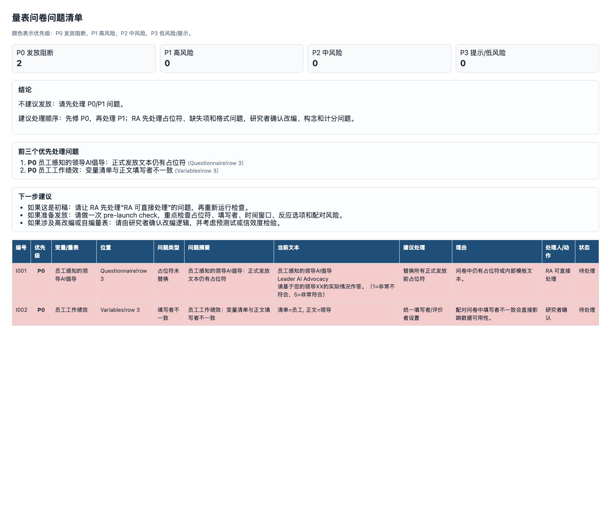

# OB Scale Review

**An Agent Skill for Codex and Claude Code that reviews organizational behavior survey scales, translated questionnaires, adapted measures, and paired leader-employee surveys.**

[中文说明](README.zh-CN.md) | [Template files](templates/) | [Prompt cookbook](docs/prompt-cookbook.md) | [Claude Code guide](docs/claude-code.md) | [Sample output](examples/sample_issues.html)



OB Scale Review helps researchers catch the problems that often appear between **"we selected the scales"** and **"the questionnaire is ready to launch"**:

- English source scale items translated into Chinese
- Mature scales adapted to AI, leadership, team, or work-task contexts
- Reverse-coded source items rewritten into positive wording
- Self-developed or highly adapted items with psychometric wording problems
- Leader-employee paired questionnaires and multi-wave survey designs
- Pre-launch issues such as placeholders, respondent mismatch, vague referents, and unclear time windows

It is designed for researchers in **organizational behavior, management, HRM, psychology, AI at work, leadership, and survey-based social science research**.

## Why This Exists

Many survey problems are not obvious until data collection is already underway:

- A research assistant translated a scale item fluently, but the adapted wording no longer measures the same construct.
- A reverse-coded source item was rewritten positively, but the scoring note still says reverse-code it.
- "My team" means coworkers to one respondent and subordinates to another.
- A leader-rated performance scale is listed as an employee self-report variable.
- A questionnaire still contains `XX`, `x月x日`, or internal notes.
- A reviewer may later ask whether an "adapted" scale is actually a newly developed scale.

This skill gives Codex or Claude Code a domain-specific review workflow for these issues.

## Quick Start

### If You Do Not Use the Command Line

Open Codex or Claude Code and paste:

```text
Please install this Agent Skill from https://github.com/gtskevin/ob-scale-review into my local skills folder.
If I am using Codex, install it under ~/.codex/skills/ob-scale-review.
If I am using Claude Code, install it under ~/.claude/skills/ob-scale-review.
```

Then start a new session and ask:

```text
Use $ob-scale-review to review my questionnaire Excel file.
```

### Codex Command-Line Install

```bash
mkdir -p ~/.codex/skills
git clone https://github.com/gtskevin/ob-scale-review.git ~/.codex/skills/ob-scale-review
```

Start a new Codex session and ask:

```text
Use $ob-scale-review to review my questionnaire Excel file.
```

### Claude Code Command-Line Install

Claude Code supports `SKILL.md`-based Agent Skills. Install the same repository into Claude's personal skills folder:

```bash
mkdir -p ~/.claude/skills
git clone https://github.com/gtskevin/ob-scale-review.git ~/.claude/skills/ob-scale-review
```

Start Claude Code and invoke:

```text
/ob-scale-review review my questionnaire Excel file.
```

See [Claude Code setup](docs/claude-code.md) for details.

If your questionnaire is not organized in a standard format, you can still ask:

```text
Use $ob-scale-review to review this questionnaire draft.
It is not in your template format, so first infer the structure and tell me what is missing.
```

## Recommended Input Options

You do **not** have to use the template, but it makes the review cleaner.

| Option | Best for | What to provide |
|---|---|---|
| Existing file | You already have an RA-prepared Excel/Word/questionnaire draft | Upload the file and ask for review |
| Recommended Excel template | You are preparing a new study or want structured review output | Use [`templates/ob_scale_review_template.xlsx`](templates/ob_scale_review_template.xlsx) |
| CSV templates | You prefer plain tables or Google Sheets | Use [`variables_template.csv`](templates/variables_template.csv) and [`questionnaire_template.csv`](templates/questionnaire_template.csv) |
| Plain text | You only have copied scale items | Paste variable names, source items, translated/adapted items, and sources |

### What the Template Captures

The template separates two things:

1. **Variable list**: construct names, respondent, wave, item count, and scale type.
2. **Questionnaire items**: source item, current translated/adapted item, source reference, and notes.

This mirrors how many OB and management researchers actually review questionnaires: first checking the research design structure, then checking the item-level wording.

## Can I Use This If...?

| Question | Short answer |
|---|---|
| My questionnaire is not in the template format. | Yes. Ask the skill to infer the structure first and list missing information. |
| I only have a Word document or survey-platform draft. | Yes. The review will focus on structure, instructions, respondent experience, and launch readiness. |
| I do not have the English source items. | Yes, but translation/adaptation equivalence cannot be fully reviewed. |
| I use mature Chinese scales. | Yes. The review can focus on respondent clarity, pairing, time windows, response options, and launch blockers. |
| I am not an OB researcher. | Possibly. The standards are optimized for OB, management, psychology, HRM, and survey-based social science research. |

## What It Checks

### Translation and Adaptation

- Does the Chinese wording preserve the source item's subject, referent, behavior, intensity, and time frame?
- If the item is adapted, can the adaptation be explained to future reviewers?
- Did the item shift from behavior to attitude, from perception to fact, or from one level of analysis to another?
- Are new or heavily rewritten items clearly marked?

### Reverse-Coded Items

The skill assumes many researchers prefer to rewrite reverse-coded source items into positive Chinese wording to reduce respondent confusion.

It checks:

- Whether the positive wording accurately reflects the intended direction
- Whether scoring notes have been updated
- Whether all items in the scale point in the same conceptual direction

### Self-Developed or Highly Adapted Items

It checks common scale-writing problems, including:

- Double-barreled items
- Leading wording
- Loaded or moralized wording
- Vague referents
- Vague time frames
- Frequency-agreement response mismatch
- Double negatives
- Unsupported assumptions
- Construct contamination
- Causal wording inside measurement items
- Overly academic language

### Paired and Multi-Wave Surveys

- Are employee-rated and leader-rated variables correctly separated?
- Are T1/T2/T3 variables consistent between the variable list and questionnaire body?
- Is the target person clear in leader-rated items?
- Are pairing IDs, respondent instructions, and time windows clear?

### Respondent Experience

The skill reviews the questionnaire from the perspective of employees and managers who may be busy, cautious, or unfamiliar with academic constructs.

It flags ambiguous expressions such as:

- "my team"
- "leader"
- "recently"
- "AI tools"
- "others"
- "work performance"

## Default Output

The skill defaults to Chinese review outputs:

1. A structured Markdown/HTML review report
2. A clean HTML issue table with Chinese headers, priority colors, and a `变量/量表` column
3. A modification suggestion table when item-level edits are needed
4. An optional optimized questionnaire comparison table after the user confirms they want it

Priority levels:

| Priority | Meaning |
|---|---|
| P0 | Launch blocker: must fix before distribution |
| P1 | High risk: likely affects data quality, scoring, pairing, or reviewer defensibility |
| P2 | Medium risk: affects clarity, wording, or respondent experience |
| P3 | Low risk or reminder: useful for polishing or documentation |

See an anonymized example: [sample HTML issue table](examples/sample_issues.html).

## Example Prompts

Full review:

```text
Use $ob-scale-review to review this Excel questionnaire.
Focus on translation quality, adapted scale defensibility, reverse-coded item handling,
leader-employee pairing, respondent ambiguity, and launch-blocking problems.
```

Pre-launch check:

```text
Use $ob-scale-review for a pre-launch check.
Do not rewrite every item; focus on placeholders, confusing instructions,
respondent mismatch, time windows, response options, and pairing risks.
```

Template-first workflow:

```text
Use $ob-scale-review. I want to prepare a scale review file from scratch.
Show me what to put into the template before reviewing it.
```

Non-template workflow:

```text
Use $ob-scale-review to inspect this questionnaire draft.
It may not follow your template. First infer the variables, respondents, waves,
source items, translated items, and missing information.
```

More examples: [Prompt cookbook](docs/prompt-cookbook.md).

## Suggested RA Workflow

1. RA prepares the questionnaire or fills the template.
2. Run a quick structure check.
3. RA handles issues marked "RA can handle" first: placeholders, missing sources, item counts, formatting.
4. The researcher handles issues marked "researcher must confirm": adapted-scale logic, construct meaning, reverse-coded scoring, self-developed items.
5. Run a pre-launch check after revisions.
6. Launch the questionnaire only after P0 issues are cleared and P1 issues are either fixed or consciously accepted.

## How to Read the HTML Issue Table

The generated HTML issue table is designed for non-technical review:

- Start with the summary at the top.
- Fix P0 issues first.
- Then review P1 issues.
- Use the `变量/量表` column to locate the affected construct.
- Use the `处理人/动作` column to decide whether RA can handle it or the researcher must confirm.
- Do not blindly accept item-rewriting suggestions when they affect construct meaning.

## Optional Workbook Inspection Script

The skill includes a helper script that extracts workbook structure and generates a clean HTML issue list.

Install dependencies:

```bash
pip install -r requirements.txt
```

Run:

```bash
python scripts/inspect_workbook.py path/to/questionnaire.xlsx --outdir outputs/review
```

Primary output:

```text
outputs/review/issues.html
```

Optional spreadsheet output:

```bash
python scripts/inspect_workbook.py path/to/questionnaire.xlsx --outdir outputs/review --xlsx
```

The script is intentionally conservative. It catches structural and launch-readiness issues; the full review still depends on the Codex skill's domain reasoning.

## What This Skill Does Not Do

- It does not replace researcher judgment about construct definition or theory.
- It does not automatically verify original journal scale wording unless source documents are provided.
- It does not guarantee measurement validity.
- It does not silently overwrite your questionnaire.
- It does not assume every adapted item is valid just because it is fluent.

## Repository Structure

```text
ob-scale-review/
├── SKILL.md
├── README.md
├── README.zh-CN.md
├── agents/
│   └── openai.yaml
├── docs/
│   ├── claude-code.md
│   ├── claude-code.zh-CN.md
│   ├── prompt-cookbook.md
│   └── prompt-cookbook.zh-CN.md
├── examples/
│   ├── sample_issues.html
│   └── sample_questionnaire_with_issues.xlsx
├── references/
│   ├── adaptation-review.md
│   ├── evaluation-rubric.md
│   ├── output-formats.md
│   ├── report-template.md
│   └── respondent-experience.md
├── scripts/
│   └── inspect_workbook.py
└── templates/
    ├── README.md
    ├── README.zh-CN.md
    ├── ob_scale_review_template.xlsx
    ├── variables_template.csv
    └── questionnaire_template.csv
```

## Keywords

organizational behavior, OB research, survey scale review, questionnaire review, scale adaptation, adapted scales, Chinese translation, management research, HRM research, psychology scales, reverse-coded items, leader-employee paired survey, supervisor-subordinate survey, multi-wave survey, AI at work, psychometrics, measurement validity, construct validity, item wording, Codex skill

## License

MIT
